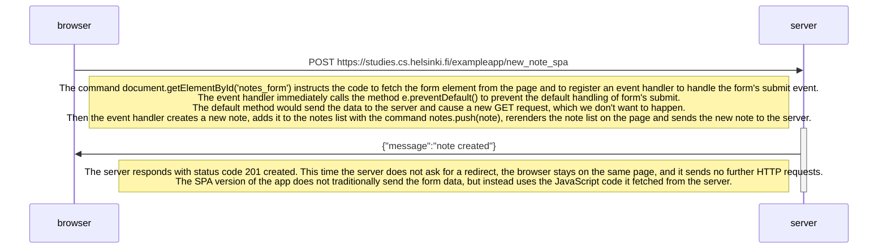

```mermaid
sequenceDiagram
    participant browser
    participant server
    browser->> server: POST https://studies.cs.helsinki.fi/exampleapp/new_note_spa
    Note right of browser: The command document.getElementById('notes_form') instructs the code to fetch the form element from the page and to register an event handler to handle the form's submit event.<br> The event handler immediately calls the method e.preventDefault() to prevent the default handling of form's submit.<br> The default method would send the data to the server and cause a new GET request, which we don't want to happen.<br>Then the event handler creates a new note, adds it to the notes list with the command notes.push(note), rerenders the note list on the page and sends the new note to the server.
    activate server
    server->> browser: {"message":"note created"}
    Note left of server: The server responds with status code 201 created. This time the server does not ask for a redirect, the browser stays on the same page, and it sends no further HTTP requests. <br> The SPA version of the app does not traditionally send the form data, but instead uses the JavaScript code it fetched from the server.
    deactivate server
```